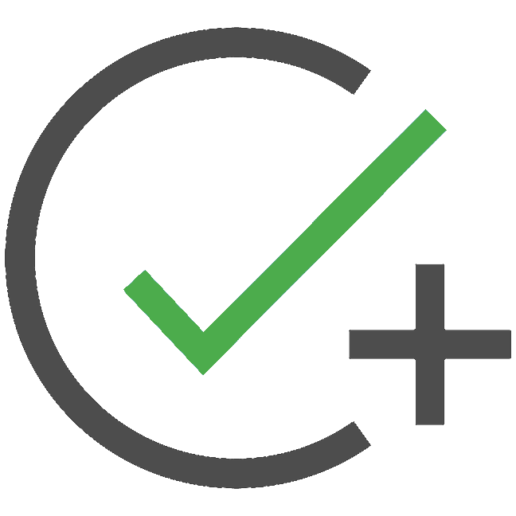
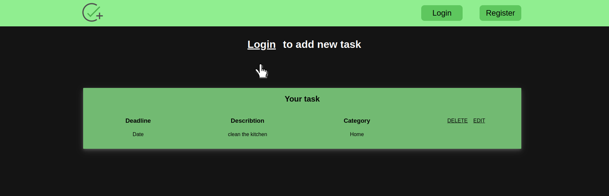
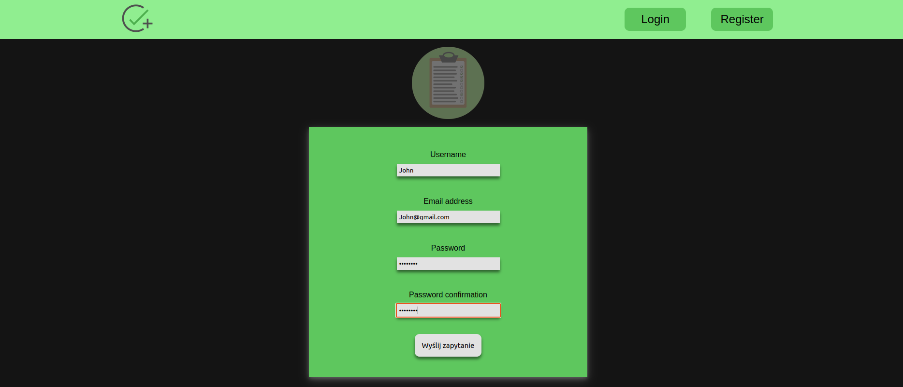
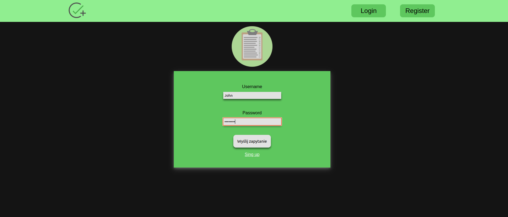
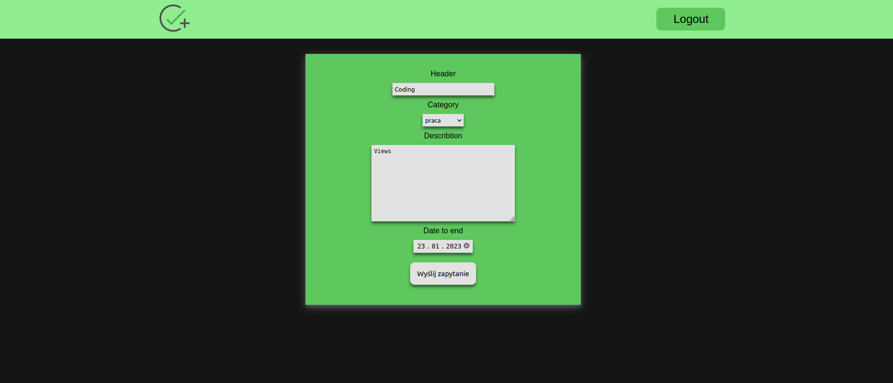
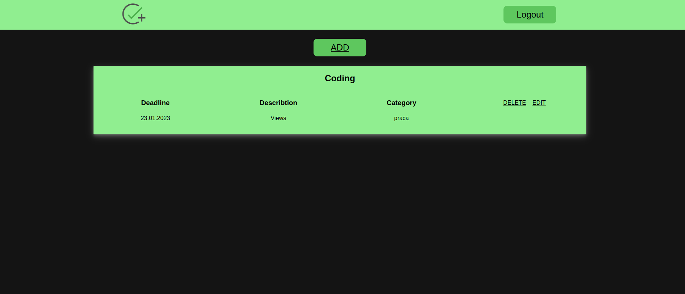

<p align="center">

</p>
<p align='center'>
Simple to do app, you can add task after login.
</p>



# Usage

At the begining you must register to have ability to add new task.



Then you can log in.



After pressing a button `ADD` you can specify your task's name, date, etc.



You can see your tasks on the main page.



# Installation on local machine

If you want to test app on your machine you can download repo, make virtual enviroment, download packages and runserver on your computer (you must have python 3.8 installed).

```
mkdir to_do
cd to_do
git init
git clone -b master https://github.com/Krzesimir04/to_do_django_app
cd to_do_django_app
python -m venv env
source env/bin/activate
cd toDO
pip install -r requirements.txt
python manage.py runserver
```

If you are on windows use `./env/Scripts/activate` instead of `source env/bin/activate`.

# Additional information

- Password validation is switched off (only minimum length is turned on)
- Python versions used with django: https://docs.djangoproject.com/en/4.1/faq/install/#what-python-version-can-i-use-with-django
